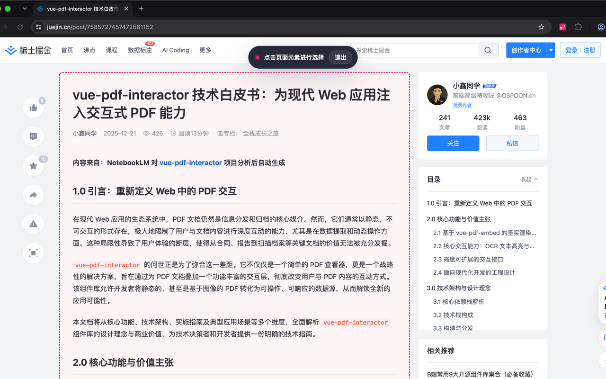
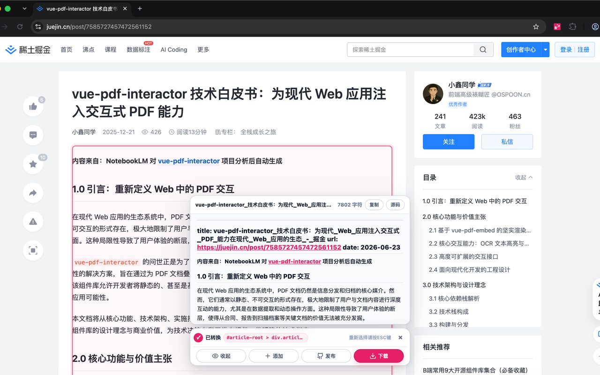

# DocScrape

将网页内容整理为 Markdown，支持选取页面区域、整页导出、图片打包和 GitHub 发布。

## 使用预览

  
  

## 主要功能

- 点选网页中的标题、正文、列表、代码块等内容
- 连续选取多个页面区域并合并导出
- 预览 Markdown 渲染效果或查看源码
- 复制或下载 Markdown 文件
- 将 Markdown 与网页图片打包为 ZIP
- 为不同网站配置独立的转换规则
- 将 Markdown 发布到 GitHub 仓库

## 开始使用

点击浏览器工具栏中的 DocScrape 图标，可以选择：

- **选取**：在当前网页中点选需要转换的内容
- **下载**：将整个页面保存为 Markdown
- **GitHub**：将整个页面发布到已配置的 GitHub 仓库

也可以在网页空白处打开右键菜单，使用 **选择导出** 或 **全页导出**。

## 选取网页内容

1. 点击 **选取**进入选择模式。
2. 移动鼠标查看高亮区域，点击需要的内容。
3. 在底部操作栏中预览、复制、添加其他区域、发布或下载。
4. 点击 **添加**可以继续选取更多内容。
5. 按 `Esc` 返回选择模式；再次按 `Esc` 退出。

多个选取区域会按照选择顺序合并到同一个 Markdown 文件中。

## 发布到 GitHub

首次发布前，在 DocScrape 设置页中配置 GitHub：

1. 填写目标仓库，例如 `owner/repo`，也可以粘贴完整仓库 URL。
2. 点击 **创建 Token**跳转到 GitHub。
3. 仅选择目标仓库，授予最小的 `Contents: Read and write` 权限。
4. 将生成的 Fine-grained Token 粘贴回设置页。
5. 点击 **测试连接**确认配置有效。
6. 根据需要填写保存目录和分支；分支留空时使用默认分支。

发布时：

- 新文件会直接创建。
- 空仓库会自动完成首次提交。
- 同名文件不会立即覆盖，需要再次点击 **确认覆盖**。
- 当前只发布 Markdown，文中的远程图片链接保持不变。

## 图片打包

在设置页启用 **将 Markdown 与图片打包为 ZIP** 后，下载操作会：

- 下载 Markdown 中引用的远程图片
- 将图片保存到指定媒体目录
- 把 Markdown 中的图片地址改为相对路径
- 将 Markdown 和图片打包为一个 ZIP 文件

可以设置 1-8 个并发下载任务。建议使用 2-4；图片下载失败时会保留原始 URL，不会中断 Markdown 导出。

## 自定义转换规则

不同网站的页面结构可能不同。可以在设置页创建多套 Markdown 转换规则，并通过页面 URL 正则自动匹配。

每套规则可以调整：

- 标题、分割线和换行格式
- 代码块及围栏字符
- 列表、斜体和加粗符号
- 行内链接或引用链接
- `pre` 内容的原始格式保留

规则按照设置页中的顺序匹配，第一条命中的规则生效。URL 正则留空的规则作为默认规则。

## 文件与 Frontmatter

设置页支持自定义文件名和 YAML frontmatter。

文件名模板可使用：

- `{{title}}`：页面标题
- `{{date}}`：导出日期
- `{{selector}}`：选取内容的页面选择器

Frontmatter 模板还可以使用 `{{url}}` 记录来源页面。

## 数据与隐私

- 设置和 GitHub Token 保存在浏览器扩展的本地存储中。
- Token 不会写入 Markdown，也不会提供给正在浏览的网页。
- GitHub 发布只会将用户确认的 Markdown 发送到所配置的仓库。
- 图片打包只会请求 Markdown 中引用的图片地址。
- DocScrape 不使用浏览器同步存储上传配置。

GitHub Token 应仅授权目标仓库，并设置合理的有效期。不再使用 DocScrape 时，建议在 GitHub 中撤销对应 Token。

## 问题反馈

使用中遇到问题，可以在 [GitHub Issues](https://github.com/OSpoon/doc-scrape/issues) 提交反馈。

## License

[MIT](./LICENSE)
